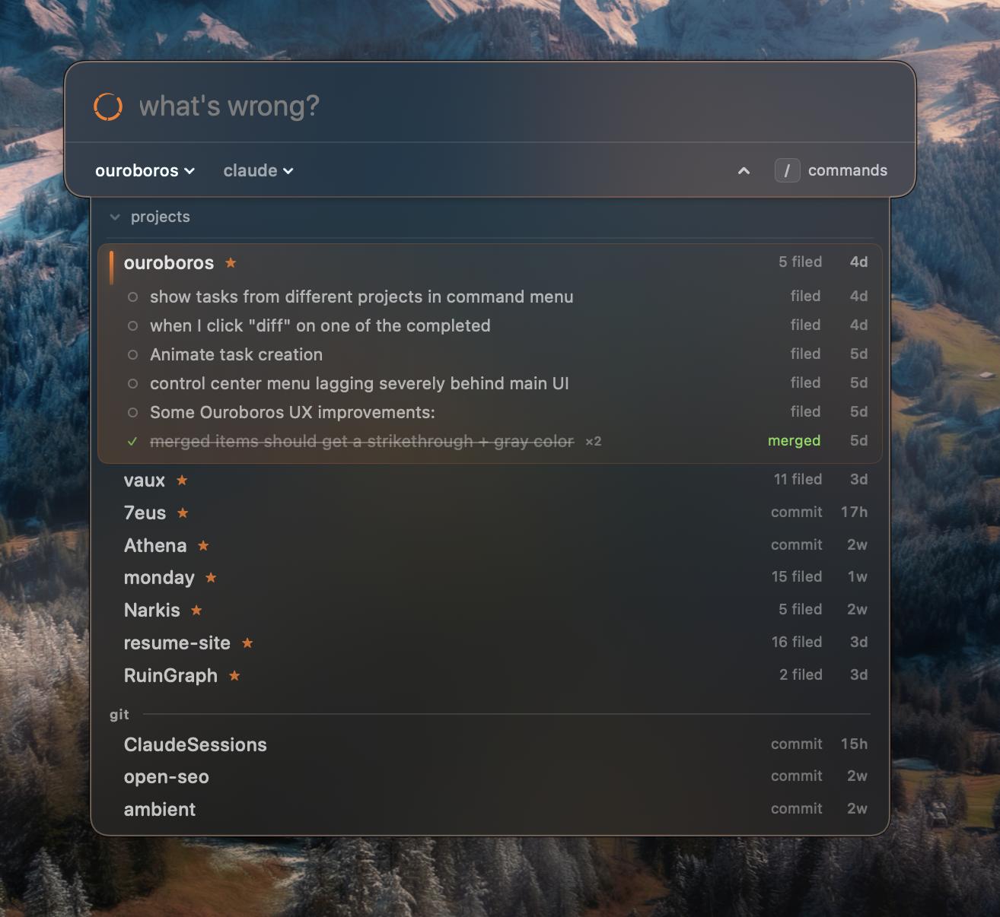

# Ouroboros

<p align="center">
  
</p>

In-app issue capture → coding agent. Your app gets a floating button; anyone using the
app describes an issue; it's saved as a markdown file in `.issues/`; one click hands it
to Claude Code or Codex in an isolated git worktree, running live in its own terminal
window that closes when the agent finishes. File ten issues, fire ten agents, walk away.

⌥Space from anywhere, type the thing, and an agent is on it — across every repo you own.

## Install it in your app

Give your coding agent this prompt:

```text
Add Ouroboros to this app.
Clone https://github.com/SignedAdam/ouroboros (or use an existing checkout),
read skills/ouroboros-integrate/SKILL.md from that repo, and follow it exactly.
$OURO = the checkout path.
```

That skill file is self-contained: it detects your app's language, installs the Swift
package or ports the pattern, wires the UI (composer, floating button, menu, issues
browser, settings), applies the mark, and ends with a verification checklist.

Machine requirements for running fixes: `git`, an agent CLI (`claude` / `codex`),
Ghostty (Terminal.app fallback exists), `gh` only if you use PR-finish.

## Ouroboros Zero — the global control plane

The package above puts a report-issue button *inside one app*. [`zero/`](zero/) puts it
**everywhere**: a daemon that supervises every agent it dispatches, a CLI, and a menu-bar
app with an ⌥Space capture panel — one core with four faces, all clients of the same
local HTTP API. It refuses to let unverified work land.

```bash
cd zero && make install
ouro projects discover ~/dev          # register every repo under a root
ouro i "the login button does nothing" --fix
```

macOS only. See [`zero/README.md`](zero/README.md), and [`zero/OPERATOR.md`](zero/OPERATOR.md)
for the API an AI operator drives it through.

## Languages

| Folder | Status |
|---|---|
| [`swift/`](swift/) | Ready — SPM package (pure engine + optional UI), full test suite; in production |
| [`python/`](python/) | Port pending — a reference implementation exists |
| [`go/`](go/) [`nextjs/`](nextjs/) [`react/`](react/) | Port pending — the skill covers porting |

## Repo layout

- `skills/ouroboros-integrate/SKILL.md` — the entry point; everything an agent needs
- `swift/` — the Swift package: `Ouroboros` (engine, no UI deps) + `OuroborosUI`
- `zero/` — Ouroboros Zero: `ourod` (daemon), `ouro` (CLI), the menu-bar app
- `brand/` — the mark: geometry spec + reference SVGs
- `docs/` — design notes

## The loop

Composer → `.issues/new/<Title>.md` (frontmatter `title`/`created`; status = folder) →
seed prompt → agent in a `fix/<slug>` worktree in its own window → the agent appends a
`## Resolution` section and moves the file to `.issues/done/` when the fix lands.
